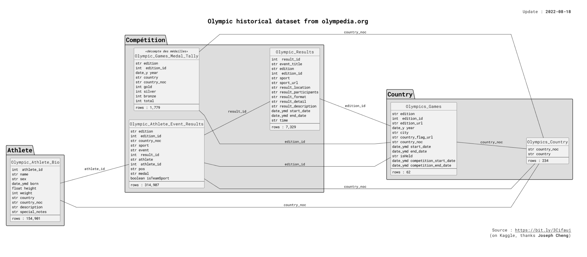

# Analysis of Olympic Historical Dataset
This repo contains assignment 1 of Computer System Design and Application (CS209) course SUSTech Fall 2024. The task is to analyse Olympic historical dataset using Java programming language and utilizing its features: Collections, Lambda, and Streams.

## Datasets Description
The dataset is sourced from [Kaggle](https://www.kaggle.com/datasets/josephcheng123456/olympic-historical-dataset-from-olympediaorg).

This dataset contains:

- 154,902 unique athletes and their biological information i.e. height, weight, date of birth
- All Winter / Summer Olympic games from 1896 to 2022
- 7326 unique results (result for a specific event played at an Olympic game)
- 314,726 rows of athlete to result data which includes both team sports and individual sports.
- 235 distinct countries (some existing from the past)

## File Structure
The src folder contains the core Java files that implement the functionality of the project. Below is an overview of each file:

### `OlympicAnalyzer.java`
- Purpose: Acts as the main class to analyze Olympic data.
- Key Responsibilities:
Load and process data about athletes, events, and results.
Provide methods for querying the analyzed data.

### `OlympicAnalyzerInterface.java`
- Purpose: Defines the contract/interface for Olympic data analysis.
- Key Responsibilities:
  Declares methods that must be implemented by OlympicAnalyzer.java.
  Ensures consistent structure for data analysis operations.

### `Person.java`
- Purpose: Represents an individual (athlete or participant) in the Olympic data model loaded from `Athlete.csv`.
- Key Responsibilities:
  Store personal details such as name, age, gender, height, weight, country, etc.

### `Result.java`
- Purpose: Encapsulates the result of a specific Olympic event.
- Key Responsibilities:
Store details such as event name, year, editionId, etc.
Provide methods to retrieve and manipulate result data.

### `OlympicResult.java`
- Purpose: Encapsulates the result of a specific Olympic event.
- Key Responsibilities:
  Store details such as event name, year, editionId, isTeam, etc.
  Provide methods to retrieve and manipulate result data.

### `OlympicGame.java`
- Purpose: Represents an Olympic game (e.g., Tokyo 2020).
- Key Responsibilities:
  Store game-specific data such as year and editionId.

### `LocalTest.java`
- Purpose: Serves as a test correctness for validating the result and functionality of the methods.
- Key Responsibilities:
  Test individual methods and features from OlympicAnalyzer.java and related classes.
  Ensure data processing and logic return expected results.
  Provide sample inputs and verify outputs for core functionalities.

## Data Analysis
The analysis will be implemented in the methods in the
`OlympicsAnalyzer` class. Method details are described below.

### 1. Top 10 Performant Female Athletes in Individual Sport
    `
    public Map<String, Integer> topPerformantFemale()
    
This method returns `<name, count>` map of size 10, where:
- the key is the name of female athlete.
- the value is the total gold medals acquired by that female athlete in individual sport (i.e. not in team sport).

The map is sorted descending order. If two athletes have the same gold medal count, then they are sorted by the alphabetical order by the name.

### 2. BMI by Sports
    `
    public Map<String, Float> bmiBySports()

This method returns a <sport, BMI> map, where:
- the key is the sport name (e.g., Athletics, Boxing, Diving, etc.)
- the value is the average BMI of the athletes of that sport. BMI is computed as weight/(height x
height) where the unit of height is the meter. The average BMI should be rounded to one decimal
place.

  The map is sorted by the descending order of average BMI (i.e., from highest to lowest). If two
  sports have the same average BMI, then they are sorted by the alphabetical order of the sport name.

### 3. Top 10 Least Appeared Summer Sports
    `
    public Map<String, Set<Integer>> leastAppearedSport()

This method returns a `<sport, set of years>` map with a size of 10, where:
- the key is the sport name (e.g., Athletics, Boxing, Diving, etc.)
- the value is set of summer Olympics years in which the sport appears.

The map is be sorted by the ascending order of the size of the set (i.e., from least appeared to most
appeared). If two sports have the same occurrences, then they are sorted by the alphabetical order of
the sport name.

### 4. Top 10 Countries by Medals in Winter Olympics since the year 2000
    `public Map<String, Integer> winterMedalsByCountry()

This method returns a `<country, count>` map with a size of 10, where:
- the key is the country code
- the value is the sum of all medals, including gold, silver and bronze, acquired by that country in all
  Winter Olympics since the year 2000 (including 2000).

The map is sorted by the descending order of count (i.e., from most to the least). If two countries
have the same medal count, then they are sorted by the alphabetical order of the country code.

### 5. Top 10 Countries with Young Athletes in 2020 Summer Olympic
    `public Map<String, Integer> topCountryWithYoungAthletes()

This method returns a `<country, age>` map with a size of 10, where:
- the key is the country name (not country code).
- the value is the average age of the athletes of that country that participate in 2020 Summer Olympic.

Athletes with no born information should be ignored.
The map is sorted by the ascending order of average age (i.e., from youngest to oldest). If two
countries have the same average age, then are sorted by the alphabetical order of the country
name.

